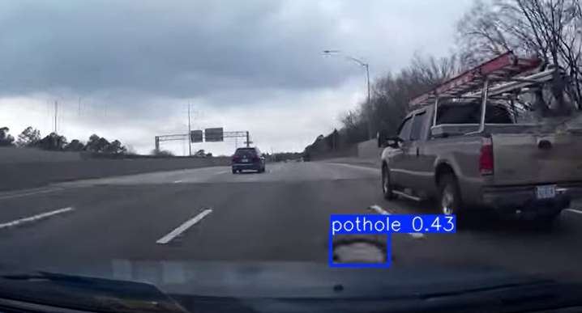

# 🛣️ Pothole Detection using Deep Learning

This project aims to detect road potholes using computer vision techniques and deep learning models.

## 🚀 Features
- Automatic pothole detection from images/videos
- Based on deep learning (CNN/YOLO/Transfer Learning)
- Easy to train and deploy

## 📂 Project Structure
- `data/` → Dataset samples (not included here)
- `src/` → Source code (dataset handling, model, training)
- `notebooks/` → Jupyter notebooks for experiments
- `requirements.txt` → Python dependencies

## ⚙️ Installation
```bash
git clone https://github.com/username/pothole-detection.git
cd pothole-detection
pip install -r requirements.txt
```

## 🏃 Usage
```bash
python src/train.py
```

## 📊 Results
Example results:


